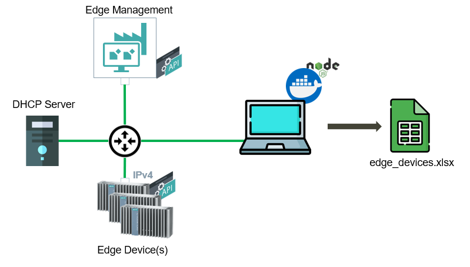
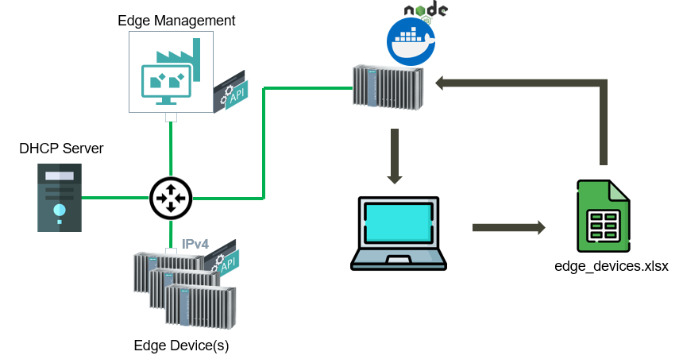

# Mass Edge Device onboarding

Automate process of onboarding and activating Edge Devices using public API. With provided application it is possible to perform mass onboarding of edge devices over 1 edge device or using separate server connected to the IEM/IEDs subnet.

- [Mass Edge Device onboarding](#mass-edge-device-onboarding)
  - [Description](#description)
    - [Overview](#overview)
    - [General task](#general-task)
      - [**Application runs on separate server**](#application-runs-on-separate-server)
      - [**Application runs on another device**](#application-runs-on-another-device)
  - [Requirements](#requirements)
    - [Prerequisites](#prerequisites)
    - [Used components](#used-components)
  - [Installation steps](#installation-steps)
  - [Documentation](#documentation)
  - [Contribution](#contribution)
  - [Licence & Legal Information](#licence--legal-information)

## Description

### Overview

This application example shows how to create application that interacts with IEM and IED public API to automaticaly onboard and activate connected Edge Devices to the IEM.

### General task

Public Edge Management's and Edge Device's API enable us to interact with a system and automate different processes. One of the process that can be automated is onboarding of Edge Devices to the IEM. Provided documentation describes how this can be done using Node.js application. The functionality of the application is as follows. When your Edge Device(s) are setup and have its own IP adress(es), you can configure the device configuration in provided excel list. The excel file has a strict structure which has to be followed in order for tha application to run correctly. Different configurations are divided in sheets and required information in the each sheet is highlighted with "*" symbol. The provided file consists of some representative examples.

 When you are done configuring the edge devices, you can run the application which then onboards all your edge devices to the IEM using different API calls. The application can run either as a standalone docker-based application or run on another edge device. The process is done synchronosly, so the devices are onboarded one after another to prevent IEM overload. More information can be found in [docs](./docs/). The pictures below show the network configuration for each use case. **Important!** This example follows the approach of running the application on edge device.

#### **Application runs on separate server**

 
#### **Application runs on another device**
 

## Requirements

### Prerequisites

- Installed Industrial Edge Management
- Linux VM with docker and docker-compose installed
- Edge Devices are setup with known IP and MAC addresses

### Used components

- Industrial Edge Device V 1.5.0-56
- Industrial Edge Management V 1.5.6
- VM Ubuntu 20.04
- Docker 19.03.13

## Installation steps

The installation steps can be found [here](docs/Installation.md).

## Documentation

- You can find further documentation and help in the following links
  - [Industrial Edge Hub](https://iehub.eu1.edge.siemens.cloud/#/documentation)
  - [Industrial Edge Forum](https://www.siemens.com/industrial-edge-forum)
  - [Industrial Edge landing page](https://new.siemens.com/global/en/products/automation/topic-areas/industrial-edge/simatic-edge.html)
  
## Contribution
Thanks for your interest in contributing. Anybody is free to report bugs, unclear documentation, and other problems regarding this repository in the Issues section or, even better, is free to propose any changes to this repository using Merge Requests.

## Licence & Legal Information
Please read the [Legal information](LICENSE.md)