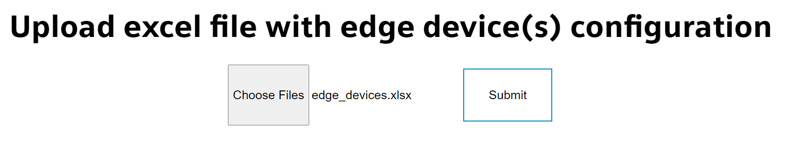
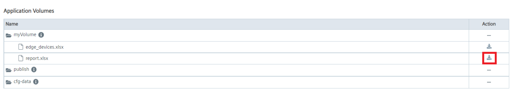

# Mass Edge Device onboarding

- [Mass Edge Device onboarding](#mass-edge-device-onboarding)
  - [Installation steps](#installation-steps)
    - [Instalation setup](#instalation-setup)
    - [Build and deploy the application](#build-and-deploy-the-application)
    - [Access the application and start the onboarding process](#access-the-application-and-start-the-onboarding-process)

## Installation steps

The document describes how to setup and deploy an node.js application that runs on one Edge Device and onboards other Edge Devices.


Apart from this solution note that the application can also run on a separate server with docker installed.

### Instalation setup

1. Clone this repository to your Linux VM that has connection to your IEM.

2. Onboard first Edge device over IEM's user interface.

3. Setup and connect your edge devices to your network which has access to the IEM and with a DHCP server available. At the end of this step, you should have the edge devices connected with a known IP addresses and ready to be activated. Your network configuration should be similar to the illustration [above](#installation-steps).

4. Open the template [excel-file](../src/excel-file/edge_devices.xlsx) and fill out the excel sheets divided based on different edge device configuration. General rules: 
  * Required fieds are marked with a "\*" symbol. 
  * Each device should have a unique ID starting from 1. 
  * If you want to have no configuration of your edge device in a certain configuration sheet, leave the colomn empty, but the ID still **has** to be there in order for the application to work correctly.
  * **IP Adress, network mask and getaway adress are only needed if DHCP is disabled!**

5. Adjust your IEM credentials in the first sheet of the excel file.
6. Save your excel file.

### Build and deploy the application

7. Go to the [src](../src) folder and open up terminal.
8. Build the docker application by running the following command.

```bash
  docker-compose build
```

9. Upload this application to IEM by using IE App Publisher. More information on how to upload an application to IEM can be found [here](https://github.com/industrial-edge/upload-app-to-industrial-edge-management).

10. Deploy your application to the first edge device.

> **_NOTE:_** This document describes the use case of running the application on another Edge device. The application can also run on a separate server with docker installed.

### Access the application and start the onboarding process

11. Go to the device UI and access the application by clicking on its icon. Click on "Choose Files" and choose the excel file with configured edge devices.



12. Click "Submit" to upload the file to the application. If the file uploaded successfully, you will get a respective message. After this step the onboarding process starts automatically.


13. After this step the edge devices should start showing in IEM and get onboarded one after another. If there are no devices in IEM, check the application logs.

14. After the process ends the application stops. You can check the application volumes and download the `report.xlsx` file to see the report of which devices have been onboarded successfully and which not.


